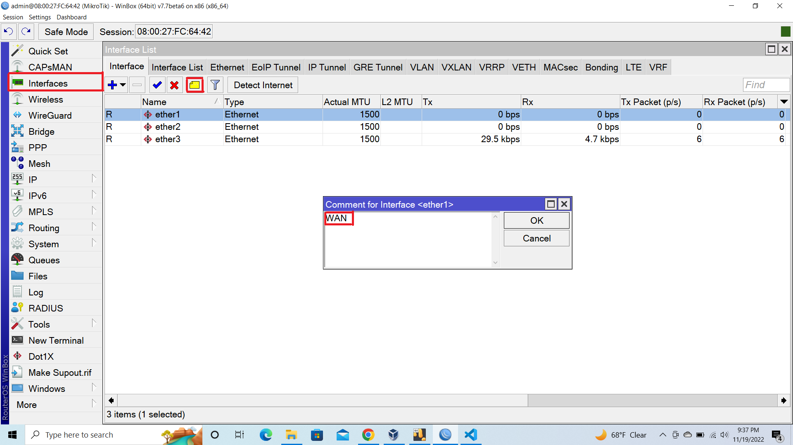
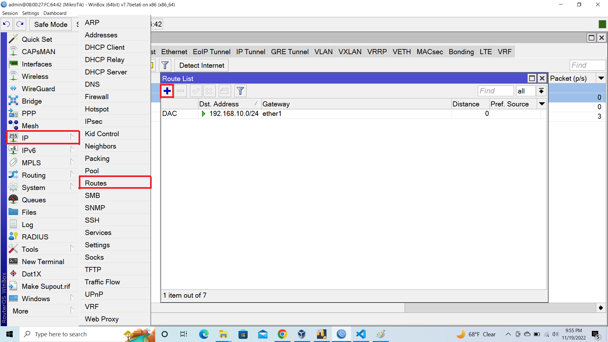

# UGV_SKILL
Advanced_Networkin Advanced-Python

 ## Microtik Basic Configuration (LAN DHCP, WAN [DHCP Client/ Static IP / PPPOE Client]) 

#### 1. Selected Interface >> click YellowBox then Comment LAN And WAN

#### 2. Click Ip Then Selected >> Addresses click Plus Icon Insert Private IP with Subnet Mask Like
`` 192.168.0.10/24 `` 
#### then Apply >> Ok

#### 3. Ip >> DHCP Client 

#### 4. click Plus Icon  Select Interface WAN Then Apply And Ok

#### 5. click IP >> DHCP Server

<!-- 

 -->

#### 6. Click DHCP Setup 

#### 7. Then Next Next And OK

#### 8. Then Setup SuccessFully

### FireWall Rull
#### 10. IP >> select Firewall >> NAT

#### 11. select Out Interface WAN 

#### 12. Goto Action Option Then Select Masquerade

## 2. Configure Microtik as a Router where WAN is using Static IP and LAN is using DHCP server.

#### 1.Goto Interfaces Then Comment WAN

#### 2. IP > Addreses click "+" Icon Then Assign Network Ip Address With Subnet Mask That Provide From ISP Select Interface (WAN) Then Click Ok

#### 3. Ip > Route Set DST. Adreses 0.0.0.0./0 Set The GateWay Provide From ISP It's Default   8.8.8.8 

