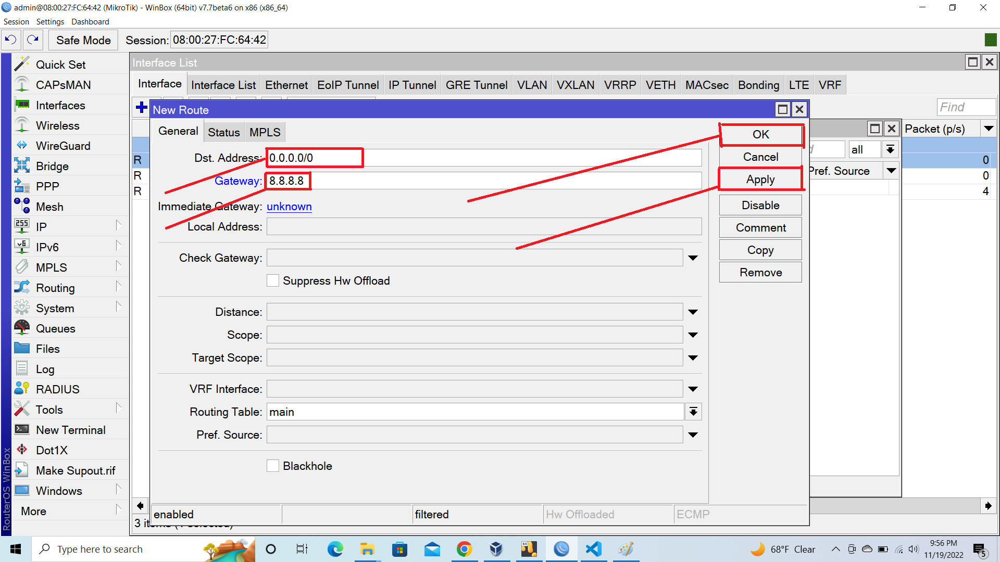
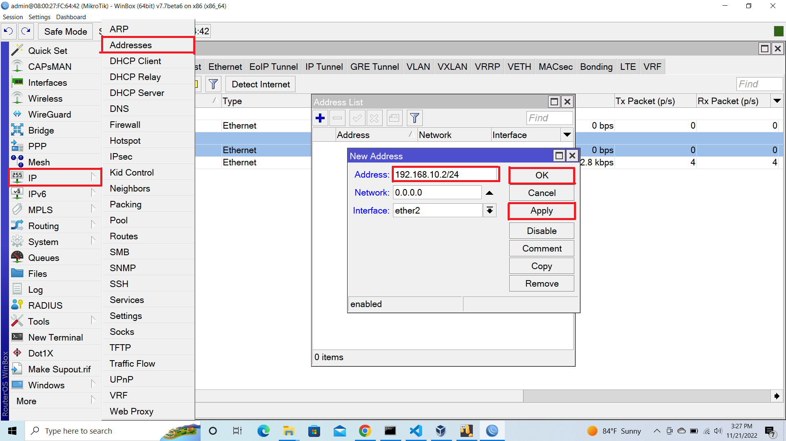
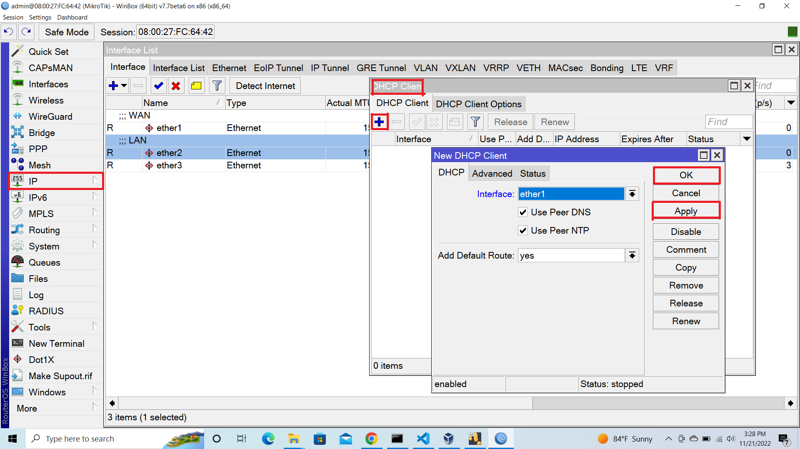
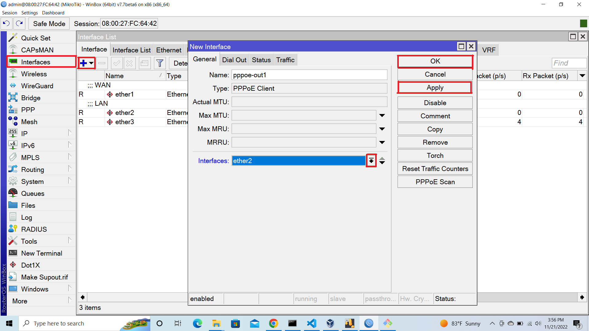
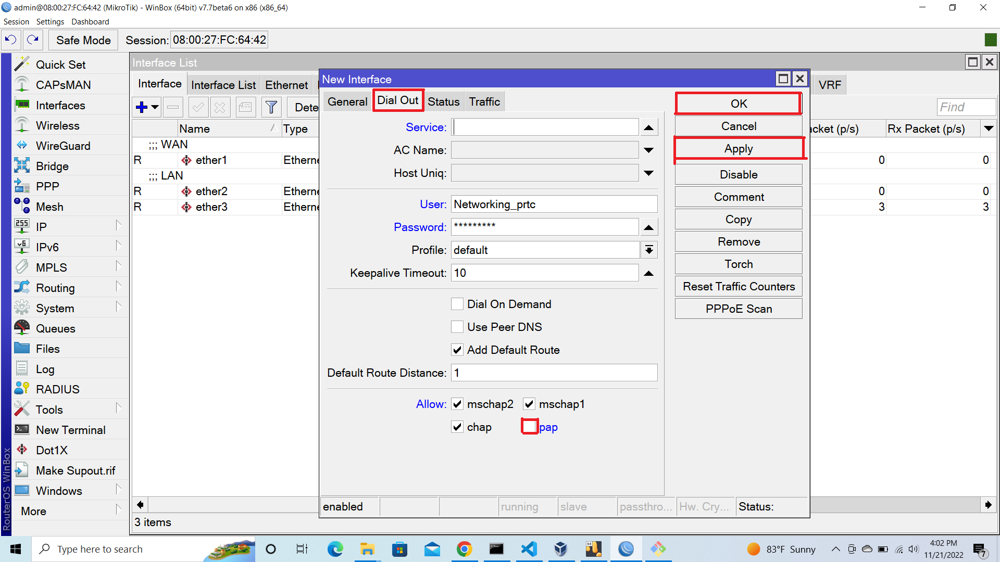
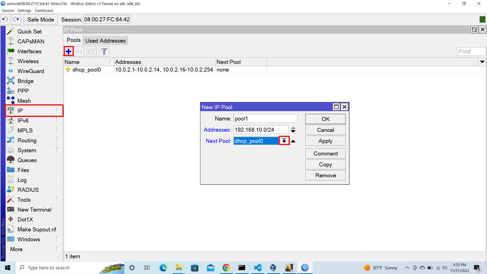
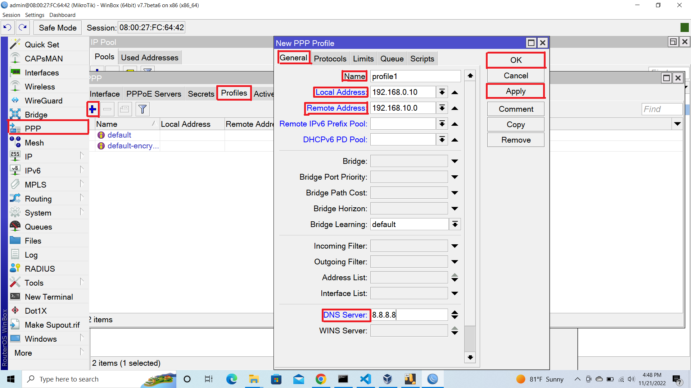
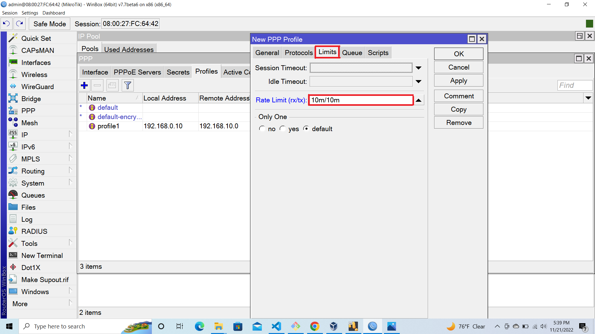
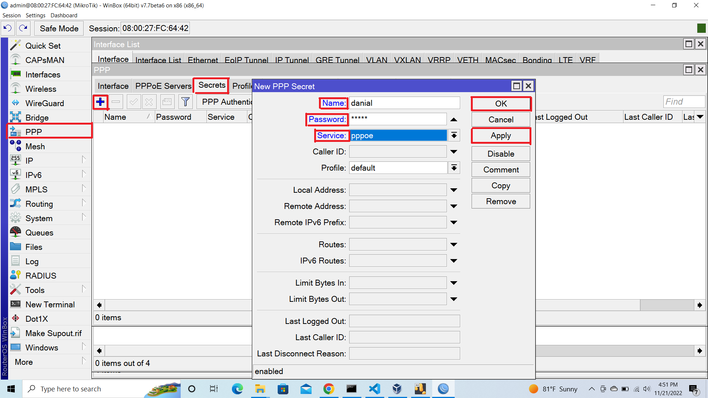

# UGV_SKILL
Advanced_Networkin Advanced-Python

 ## Microtik Basic Configuration (LAN DHCP, WAN [DHCP Client/ Static IP / PPPOE Client]) 

#### 1. Selected Interface >> click YellowBox then Comment LAN And WAN

#### 2. Click Ip Then Selected >> Addresses click Plus Icon Insert Private IP with Subnet Mask Like
`` 192.168.0.10/24 `` 
#### then Apply >> Ok

#### 3. Ip >> DHCP Client 

#### 4. click Plus Icon  Select Interface WAN Then Apply And Ok

#### 5. click IP >> DHCP Server

<!-- 

 -->

#### 6. Click DHCP Setup 

#### 7. Then Next Next And OK

#### 8. Then Setup SuccessFully

### FireWall Rull
#### 10. IP >> select Firewall >> NAT

#### 11. select Out Interface WAN 

#### 12. Goto Action Option Then Select Masquerade

## 2. Configure Microtik as a Router where WAN is using Static IP and LAN is using DHCP server.

#### 1.Goto Interfaces Then Comment WAN

#### 2. IP > Addreses click "+" Icon Then Assign Network Ip Address With Subnet Mask That
#### Provide From ISP Select Interface (WAN) Then Click Ok

#### 3. Ip > Route 

#### 4. Set DST. Adreses 0.0.0.0./0 Set The GateWay Provide From ISP It's Default   8.8.8.8 

## 3. Configure Microtik router as a Gateway where WAN haveing DHCP protocol, and configure lan network. 

#### 1. Go to Interface And Comment
#### 2. Go to IP >> Address Click On "+" Icon Then Write Private Ip With Subnet Mask Select the Interface (LAN) then OK

#### 3.Ip >> DHCP Client => click "+" and Select Interface (WAN) >> Apply And OK

#### 4. IP > DHCP Server => DHCP Setup => Select (LAN) Interface Now Click Next one by one

#### 5. IP > Firewall > NAT > Click "+" > Set 'Out Interface' As WAN > Goto Action Tab > Change Action to "masquerade" => Apply Then OK

## 4. Configure PPPOE Client on WAN interface, and implement local network (Using DHCP or PPPOE)

#### 1. Interfaces > Click "+" >PPPoE Client > Name The PPPoE >go to Dial Out > Now set User And Password > Make Sure That You Unmark "PaP" > Apply and Ok

#### 2.IP >Addreses > "+" > Assign Private Ip With Subnet Mask > Interface (LAN) > Apply Then Ok

#### 3. IP > DHCp Server > DHCP Setup > LAN Interface > Noew Click Next One by one

#### 4. IP > Firewal > NAT >Click "+" > Out Interface > As PPPOe Client Name > Action Tab >Change Action "Masquerade" > Apply Then Ok

## 5. Design ISP for (100 Mb Bandwidth) and Create 4 packages for customer

#### 1. IP > Pool > click "+" > Pool Name > Assign Pool IP Range In Address Bar > Apply Then Ok

##### 2. Go PPP > Profiles > Click "+" General Tab Set The Package Name > Assign Local Address That we reserve In Step 1 > Remote Address Select The Pool Tha You Want To configure > Set DNS Same The Local Ip > Set Alternative DNS > Go Limits Tab > Define Bandwidth Rate > Apply Then Ok

#### 3. Preview Same Tab Goto Secraets  > Click "+" Set New User Name & Password > Select Service To PPPOe  > Select The Package > Apply > Ok

#### 4. Preivious Tab goto PPPOE Server > Click "+" Assign The Service Name > Select The Interfaces (LAN) > Mark  "On Session Per Host" > Unmark "pap" > Apply Then Ok

#### 5. IP > DNS > Set Server That You Get From IIG > Set Alternative DNS > Apply Then OK

#### 6. Repeat Again From Step 1 for Another 3 Package

